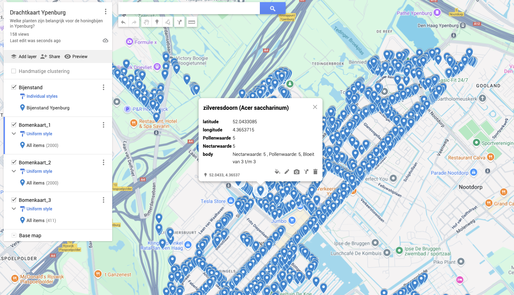

# Bomenkaart voor bijen obv Den Haag

Maken van een bomenkaart met drachtbomen in directe nabijheid van Ypenburg

Combinatie van de bomenkaarten delft, den haag (nootdorp?) en de drachtplanten informatie van imkerpedia

## TODOs

- [] splitsen van de dracht informatie in meerdere lagen - lente / zomer / herfst zodat zichtbaar wordt wanneer er minder drachtaanbod beschikbaar is
- [] TODO clusteren bomen/shapes obv dichtbijheid van elkaar / grouperen shapes -> Vlakken van maken ? hoe dan? export in csv kan dat niet, KML?
- [x] Data fouten in denhaag vinden - welke bomen zijn er uitgefilterd obv typo's die er hadden moeten zijn?
- [] TODO - import in google maps is max 2000 datapunten per layer, max 10 layers totaal 10.000 datapunten -> clusteren?
  - specs KML layer om shapes te importeren? https://developers.google.com/maps/documentation/javascript/kmllayer?csw=1 

## Setup

- Download the tree info from den haag
    - https://denhaag.dataplatform.nl/#/data?autocomplete_field=(bomen) // https://denhaag.dataplatform.nl/#/data/77879f91-3d48-47dd-b33d-9e86ae5d99de
    - put the json file from den haag `bomen-json.json` in the `\source` folder
- Download the tree infrom from Delft
    - https://openbomenkaart.org/data/trees_delft.json and put it in the `\source` folder
- Download the drachtplanten table information from Imkerpedia - https://www.imkerpedia.nl/wiki/index.php/Drachtplanten
    - take the table and convert it to CSV using Excel manually and store it as `\source\drachtplanten-imkerpedia.csv`
    - convert it to json `csvjson drachtplanten-imkerpedia.csv | jq '.' > drachtplanten-imkerpedia.json`
    - extract the ids of the drachtplanten `jq '[.[]."Latijnse naam"]' drachtplanten-imkerpedia.json . drachtplanten-ids.json`
    - cleanup the nectarwaarde/pollenwaarde fields to only contain digits
        - `jq 'map(.Nectarwaarde |= gsub("[^0-9]+"; ""))' drachtplanten-imkerpedia.json | jq 'map(.Pollenwaarde |= gsub("[^0-9]+"; ""))' > drachtplanten-imkerpedia-cleanedup.json`
- Retrieve the bomen data export from Nootdorp via e-mail to the municipality
	- only retian the name/nl name/x/y fields in the excel and export to csv
	- `csvjson Bomenbestand-Nootdorp-20250701.csv | jq '.' > Bomenbestand-Nootdorp-20250701.json`
	- find all the unique tree names to determine cleanup rules `jq '[.[] | .Soortnaam | select(length > 0)] | unique' Bomenbestand-Nootdorp-20250701.json > Bomenbestand-Nootdorp-Unique-Bomen.json`


## Den Haag Bomen Data


https://denhaag.dataplatform.nl/#/data?autocomplete_field=(bomen)
https://denhaag.dataplatform.nl/#/data/77879f91-3d48-47dd-b33d-9e86ae5d99de

```
{
"type" : "FeatureCollection",
	"name" : "bomen",
	"crs" : {
		"type" : "name",
		"properties" : {
			"name" : "EPSG:28992"
		}
	},
	"features" : [
		{
			"type" : "Feature",
			"geometry" : {
				"type" : "Point",
				"coordinates" : [ 80080.418, 458531.333 ]
			},
```

### dmv jq filteren op enkel regio ypenburg

converteren coordinaten -> https://benhup.com/tools/convert-coordinates/

topleft: 52.05325316920707, 4.3431938539781525
	RD => 83395 452175

bottom right: 52.02743574217603, 4.404156672597446
	RD => 87537 449244

## Delft Bomen Data

obv databron
- https://openbomenkaart.org/data/trees_delft.json
- filteren obv coordinaten die dichtbij genoeg zijn

links onder coordinaat = 52.02691, 4.34384 & rechts boven coordinaat = 52.05377, 4.40361

`jq '.elements | map(select(.lat >= 52.02691 and .lat <= 52.05377 and .lon >= 4.34384 and .lon <= 4.40361))' trees_delft.json > filtered-local-trees-delft.json`

## convert to CSV output and import into google maps

import the CSV with markers into google maps -> https://www.google.com/maps/d/u/0/edit?hl=en&mid=1rEXjvP8rAoK41iPF5tkkcRLcWMVaP8c&ll=52.03850518347734%2C4.366191369035044&z=15

and... profit!




## credits

rijksdriehoek to wgs84 script copied from https://github.com/arjendeblok/rd2wgs84/tree/main
